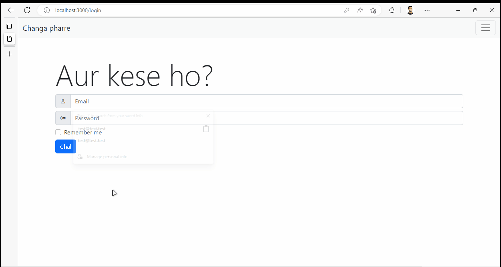
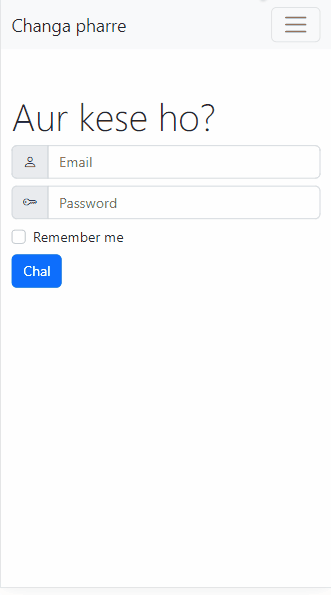

<h1 align="center">Welcome to Change pharre 👋</h1>
<p>
  
  <a href="https://unlicense.org" target="_blank">
    
  </a>
</p>

> Change pharre is a note-taking app for managing personal notes, capturing your thoughts and accessing them from any device. It has been developed with MERN WebDev stack.




## Install

```sh
npm install
```

## Usage

```sh
npm run start
```

## Credits
This project has been developed while referencing from [this](https://www.youtube.com/playlist?list=PLu0W_9lII9agx66oZnT6IyhcMIbUMNMdt) YT tutorial

## 📝 License

This project is [UNLICENSE](https://unlicense.org) licensed.

***
_This README was generated with ❤️ by [readme-md-generator](https://github.com/kefranabg/readme-md-generator)_
